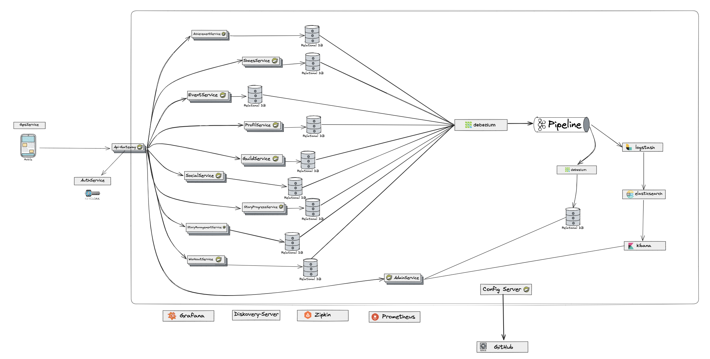
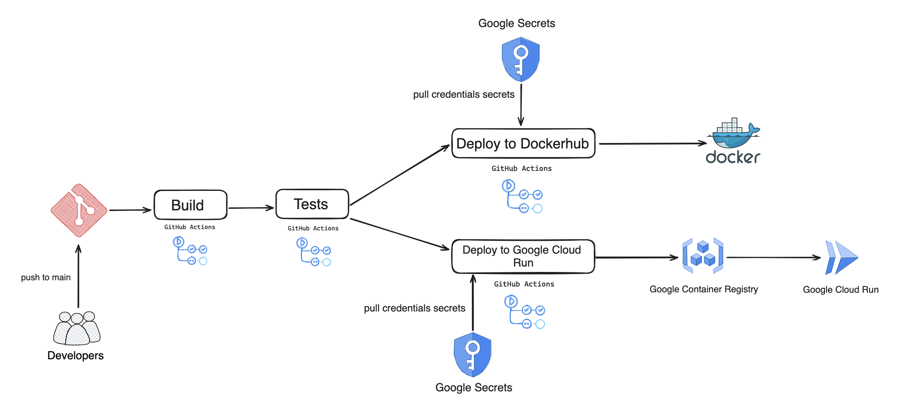
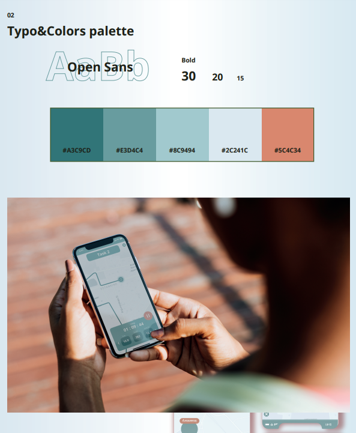
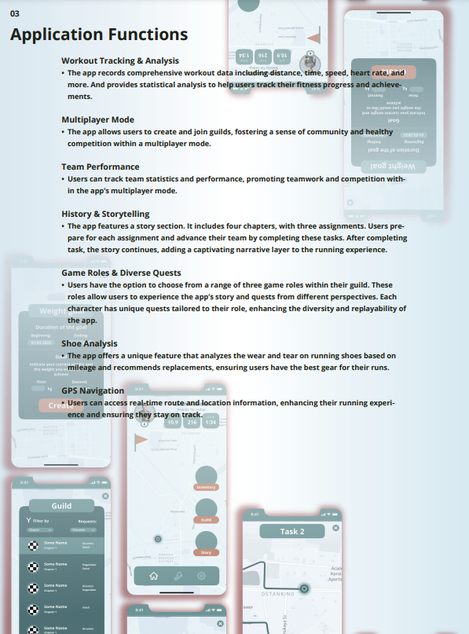
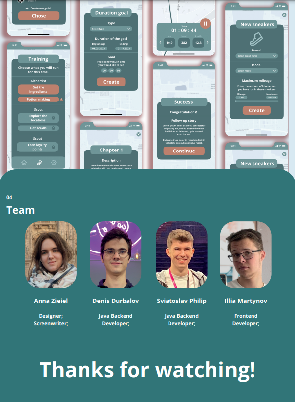

# Run App 🏃‍♂️🏃‍♀️

Welcome to the Run App repository! This mobile application is your ticket to a new and exhilarating running adventure.

# About the Project 🔎

**Introducing the Ultimate Running Adventure: Chasing Relics!**

Are you tired of the same old running routine? Breathe new life into your fitness journey with Run App, the innovative app designed by a team of designers and programmers who are passionate about making your runs exhilarating.

Step into a world where your daily jog becomes a thrilling quest! Explore the story, choose a playable role, conquer missions, and choose wisely. Our unique concept blends the world of running with the excitement of a quest game. Say goodbye to monotony and hello to adventure.

Our mission is simple: to transform running into an unforgettable experience. Join us in this exhilarating journey towards a healthier, fitter, and more adventurous you. Don’t just run; run with a purpose.

# System design 🧮



- Documentation describing the API and a description of each service : [swagger-ling](https://app.swaggerhub.com/apis/DenisDyrbalov/Run_App/1.0.0)

# Application Features 🧨

### Workout Tracking & Analysis
- The app records comprehensive workout data including distance, time, speed, heart rate, and more. And provides statistical analysis to help users track their fitness progress and achievements.

### Algorithm for building personal training
- This feature is a tool for creating personalized running plans based on the user's individual characteristics. Running is a great way to stay fit, but every person is unique and so are their training needs. This feature allows you to create an optimal running plan based on various parameters such as fitness, training goals, injury history and other characteristics.

### Multiplayer Mode
- The app allows users to create and join guilds, fostering a sense of community and healthy competition within a multiplayer mode.

### Team Performance
- Users can track team statistics and performance, promoting teamwork and competition within the app’s multiplayer mode.

### History & Storytelling
- The app features a story section. It includes four chapters, with three assignments. Users prepare for each assignment and advance their team by completing these tasks. After completing a task, the story continues, adding a captivating narrative layer to the running experience.

### Game Roles & Diverse Quests
- Users have the option to choose from a range of three game roles within their guild. These roles allow users to experience the app’s story and quests from different perspectives. Each character has unique quests tailored to their role, enhancing the diversity and replayability of the app.

### Shoe Analysis
- The app offers a unique feature that analyzes the wear and tear on running shoes based on mileage and recommends replacements, ensuring users have the best gear for their runs.

### GPS Navigation
- Users can access real-time route and location information, enhancing their running experience and ensuring they stay on track.

# CI/CD ✅



Step 1. Build:
 -  Checkout the repository.
 - Set up JDK 20 using the AdoptOpenJDK distribution.
 - Build the project using Maven, skipping tests.
Step 2. Tests:
 - Checkout the repository.
 - Set up JDK 20.
 - Run tests using Maven.
Step 3. Deploy to Docker Hub:
 - Checkout the repository.
 - Authenticate with Google using provided credentials.
 - Install dependencies.
 - Copy secrets from Google Secret Manager.
 - Set up Docker Buildx.
 - Login to Docker Hub.
 - Build Docker image and push it to Docker Hub.
Step 4. Deploy to Google Cloud Run:
 - Checkout the repository.
 - Authenticate with Google using provided credentials.
 - Install dependencies.
 - Copy secrets from Google Secret Manager.
 - Authenticate Docker with Google Artifact Registry.
 - Generate a unique hash for the container image tag.
 - Build and push container to Google Artifact Registry.
 - Deploy the container to Cloud Run.

# Installation 🏁

To get started with the Run App, follow these steps:

1. Open a Terminal or Command Prompt:
   - If you're on Windows, you can use Command Prompt or PowerShell.
   - On Linux or macOS, use the Terminal.

2. Navigate to the Directory:
   - Use the cd command to navigate to the directory where you saved the docker-compose.yml file.
```bash
cd /path/to/your/docker-compose-directory
```

3. Run Docker Compose:
   - Execute the following command to start the Docker Compose process. Replace docker-compose.yml with the actual filename if it's different.
```bash
docker-compose up
```

4. Wait for Completion:
   - Docker will download the necessary images and start the containers. This might take some time depending on your internet connection.

6. Access Your Application:
   - Once the process completes, you should see output indicating that your application is running. Access it through a web browser or another specified method.

8. Stopping the Containers:
   - To stop the running containers, open a new terminal window, navigate to the same directory, and run:
```bash
docker-compose down
```

9. This stops and removes the containers.

# All links available for the project:

## Main Swagger(permanent documentation)
General API documentation for all services, which is done every couple of weeks

- **main swagger documentation:** [swagger-ling](https://app.swaggerhub.com/apis/DenisDyrbalov/Run_App/1.0.0)


## Services Swagger(dynamic documentation)
Dynamic API documentation that changes during application development and deployment to servers. You need to wait some time for the link to work (10-30 seconds). If after this time the link does not work, it means that we have temporarily turned off the database in the cloud to save money 😁

- **profile-service:** [profile-service-ling-google-cloudrun](https://profile-service-4itoauiicq-lm.a.run.app/swagger-ui/index.html)
- **social-service:** [social-service-ling-google-cloudrun](http://localhost:5000/swagger-ui/index.html)
- **workout-service:** [workout-service-ling-google-cloudrun](https://workout-service-4itoauiicq-lm.a.run.app/swagger-ui/index.html)
- **guild-service:** [guild-service-ling-google-cloudrun](https://guild-service-4itoauiicq-lm.a.run.app/swagger-ui/index.html)
- **event-service:** [event-service-ling-google-cloudrun](https://event-service-4itoauiicq-lm.a.run.app/swagger-ui/index.html)
- **shoes-service:** [shoes-service-ling-google-cloudrun](https://shoes-service-4itoauiicq-lm.a.run.app/swagger-ui/index.html)
- **achievement-service:** [achievement-service-ling-google-cloudrun](https://achievement-service-4itoauiicq-lm.a.run.app/swagger-ui/index.html)
- **story-manager-service:** [story-manager-service-ling-google-cloudrun](https://story-manager-service-4itoauiicq-lm.a.run.app/swagger-ui/index.html)
- **story-progress-service:** [story-progress-service-ling-google-cloudrun](https://story-progress-service-4itoauiicq-lm.a.run.app/swagger-ui/index.html)
- **storage-service:** [storage-service-ling-google-cloudrun](https://storage-service-4itoauiicq-lm.a.run.app/swagger-ui/index.html)

## Additional Services

- **Prometheus:** [prometheus-uri](http://34.116.243.166:80)
- **Grafana:** [grafana-uri](http://34.116.243.166:3000)
- **Keycloak:** [keycloak-uri](https://lemur-14.cloud-iam.com/auth/admin/runapp-keycloak/console/)

| Service-Name | Username | Password       | URI                                                                | Permission |
|--------------|----------|----------------|--------------------------------------------------------------------|------------|
| Grafana      | admin    | Denis25032001_ | http://34.116.243.166:80                                           | read       |
| Prometheus   | none     | none           | http://34.116.243.166:3000                                         | read       |
| Keycloak     | admin    | Denis25032001_ | https://lemur-14.cloud-iam.com/auth/admin/runapp-keycloak/console/ | read       |


# Technologies Used 💻

- **Frontend:** React.js, Axios
- **Backend:** Spring Boot, Spring Cloud
- **Google cloud :** Cloud Run, Container Registry, Google Secrets, IAM, SQL
- **DevOps tools :** Docker, GitHub Actions, Shell Scripts, Grafana, Zipkin, Prometheus
- **Database:** Postgres, MongoDB, Redis
- **CSS Framework:** React Css modules
- **Aditional Technologies:** Adminer, Keyclock, 


# Contributing 🤝

If you would like to contribute to the development of this web application, please follow these guidelines:

1. Fork this repository.
2. Create a new branch for your feature or bug fix: `git checkout -b feature-name`
3. Make your changes and commit them: `git commit -m "Add feature-name"`
4. Push your changes to your forked repository: `git push origin feature-name`
5. Create a pull request to merge your changes into the main repository.

# Contact 📧

If you have any questions or need assistance, please contact any of our team members:

Backend: [Denys Durbalov](https://www.linkedin.com/in/denpool/)

Backend: [Maxim Makhrevych](https://www.linkedin.com/in/denpool/)

Backend: [Sviatoslav Pylyp](https://www.linkedin.com/in/sviatoslav-pylyp/)

Android: [Denis Shulgin](https://www.linkedin.com/in/denpool/)


Thank you for using the Your Bank Web Application! 💼🌐

# Presentation

- Design uri: [figma](https://www.figma.com/file/MS2lV8CQ3amrEmEtQtrnLV/Elemental-Sprints%3A-Chasing-Relics?type=design&node-id=1%3A435&mode=design&t=imPGQNklqepDJPwc-1)





