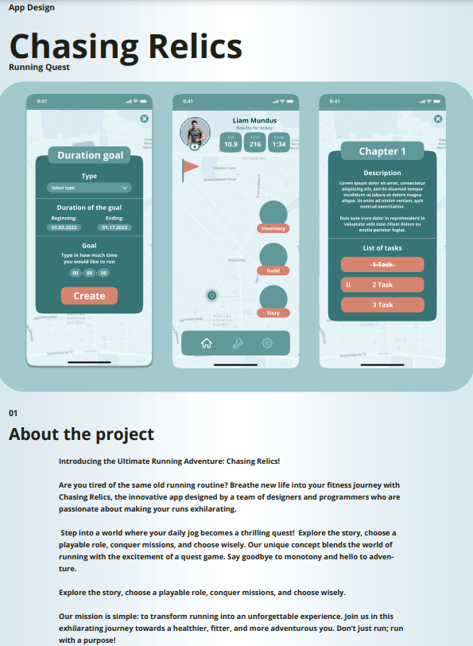

# Messenger

## Introduction

Welcome to our project! We are a group of developers and designers working together on a mission. Our project focuses on crafting a messenger influenced by Telegram and WhatsApp. Our aim is to establish a user-friendly and secure space for messaging and sharing various media. This endeavor is tailored to suit the preferences of students, young individuals, and diverse interest-based communities. 😊🚀

## Project Overview

Our messenger will be available in two versions: a phone app and a computer version, ensuring seamless communication across platforms. 📱💻

## Application Functions

Here's a brief overview of the key functions our messenger application offers:

- **User Registration:**
  - Register users using phone numbers. 📱🔒
  
- **Messaging:**
  - Send text, photos, videos, audio, and documents. 📷🎥🎧📄
  - Edit or delete sent messages. ✏️🗑️

- **Group Chats:**
  - Create group chats. 👫👫👫
  - Add participants using group IDs. ➕👥

- **One-to-One Chats:**
  - Engage in one-to-one chats. 👥

- **Online Status:**
  - Display online/offline status. 🟢🔴
  - Show the last login timestamp. 🕒

- **User Settings:**
  - Modify user settings, including login, password, and phone number. ⚙️📝📞

- **User and Chat Search:**
  - Search for users and chats by name or phone number. 🔍👤

## Installation 

To run this web application locally, follow these steps:

1. Clone this repository to your local machine:

```bash
git clone https://github.com/illiamartynov/Bank_App.git
```

## CI/CD


Step 1. Build:
 -  Checkout the repository.
 - Set up JDK 20 using the AdoptOpenJDK distribution.
 - Build the project using Maven, skipping tests.
Step 2. Tests:
 - Checkout the repository.
 - Set up JDK 20.
 - Run tests using Maven.
Step 3. Deploy to Docker Hub:
 - Checkout the repository.
 - Authenticate with Google using provided credentials.
 - Install dependencies.
 - Copy secrets from Google Secret Manager.
 - Set up Docker Buildx.
 - Login to Docker Hub.
 - Build Docker image and push it to Docker Hub.
Step 4. ArgoCD Image Updater:
 - ArgoCD image updater monitors dockerhub for new container versions. If a new version of the container appears, it changes the kubernates manifest files and commits to the repository with the manifest files

Step 5. ArgoCD:
 - Monitors the Git repository with manifest files. If changes appear in the manifest files, deployment occurs to the kubernates cluster

## Technologies Used

To bring this project to life, we utilized a variety of technologies:

- **Backend:** Java ☕
- **Version Control:** Git 📜
- **Database:** Posgres 🗃️
- **DevOps tools:** Docker, ArgoCD, Github Actions, ArgoCD Image Updater, Kubernates  
- **Application Framework:** Spring Boot, Spring Cloud, Spring WebSocket 🚀
- **Metrics:** Grafana, Prometheus 🚀
- **Distributed Tracing System:** Zipkin 🚀
- **Api Documentation:** Swagger 📜
- **Cloud Hosting:** Google Cloud ☁️

Thank you for exploring our project, and we look forward to delivering a top-notch messaging experience for users across various platforms. 🌟

## Contributing

If you would like to contribute to the development of this web application, please follow these guidelines:

1. Fork this repository.
2. Create a new branch for your feature or bug fix: `git checkout -b feature-name`
3. Make your changes and commit them: `git commit -m "Add feature-name"`
4. Push your changes to your forked repository: `git push origin feature-name`
5. Create a pull request to merge your changes into the main repository. 🛠️

## Contact

If you have any questions or need assistance, please contact any of our team members:

Frontend: [Illia Martynov](https://www.linkedin.com/in/illia-martynov-335800283/) 👨‍💻

Backend: [Denys Durbalov](https://www.linkedin.com/in/denpool/) 👨‍💻

Thank you for using the Your Bank Web Application! 🙏

## Presentation




